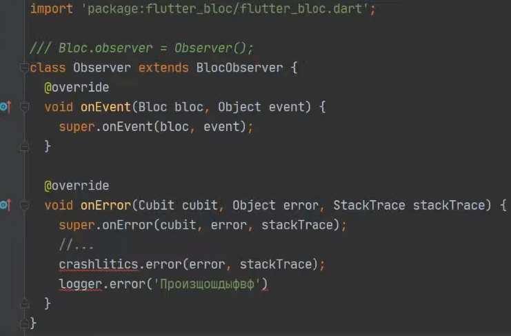

# Flutter bloc туториал

## ВВЕДЕНИЕ

### Что такое архитектура

Архитектура нужно для создания маштабируемых приложениях, которое легко поддерживать, тестировать и
изменять.

В первую очередь от хорошей архитектуры ожидают низкую зацепления, когда модули между собой вообще
не связаны или слабо свзяны. То есть изменеия в одном модули не должны вообще повлиять на другие или
слабо повлиять.

Пример с постройкой домом. Каждая комната - это модули, выполняющую определенную роль (кухня,
спальня, ванная и т.д). С хорошим архитектурой можно дом легко расширять дом, что-то менять внутри
одной из комнат или убрать комнату, не затрагивая другие или слабо на их влиять.

Для решения каких-то задач используют уже готовые решение. Для дома - это как правильно сделать
фундамент или каркас дома. В программирования есть [GRASP](https://ru.wikipedia.org/wiki/GRASP).

### Путь изучения BLoC

1) Future
2) Stream
3) Почитать паттерн [издатель-подписчик](https://refactoring.guru/ru/design-patterns/observer)
   Это про реактивщину.
4) Что
   такое [реактивное программирования](https://www.didierboelens.com/2018/08/reactive-programming-streams-bloc/)
5) RxDart - extension к dart stream и есть много готовых StreamTransformer для работы с стримами.
6) [StreamTransformer](https://api.flutter.dev/flutter/dart-async/StreamTransformer-class.html) -
   класс, в котором описина логика преобразования стрима (изменения порядка, сортировка, фильтрация
   и что угодно). Спомощи него можно создать кастомный StreamTransformer.
7) [Flutter bloc documentation](https://bloclibrary.dev/)

Дополнительная информация:

1) [Отличие BLoC - Provider - Redux](https://www.didierboelens.com/2019/04/bloc-scopedmodel-redux-comparison/)
2) [Рекоммендация по написанию flutter bloc](https://gist.github.com/PlugFox/7ee89778d0145f3bba704dbc4e4002da)

### Концепция BLoC

BLoC позволяет 3 основные вещи:

- снизить зацепления между модулями, так как мы для каждого модуля создаем свой bloc.
- легко маштабировать, так как для нового модуля нам надо создать новый bloc
- сделать приложения реакивным

Также он легко тестируемый и есть готовые пакеты для теста bloc.

## Flutter bloc

### Cubit

Cubit - это Stream (broadcast) только с состояниями и все. А UI слушает stream состояние и билдиться
как надо.

В Cubit мы обращаемся через функции, в котором меняется состояния. Состояния в кубите по дефолту
имеет очередность. Но если мы поменячем функцию как Future<void>, то очередность состояний станет
асихронной.

### Bloc

В Bloc в отличие от Cubit есть 2 streams:

1) Stream состояний;
2) Stream событий;

Метод **mapEventToState** - это асинхронный генератор, который преобразует событий в состояние. А UI
слушает (.listen) stream состояние и билдиться как надо.

Метод **transformEvents** - позволяет нам преобразовать очередность событий. До какой-то версии bloc
обрабатывал событии по очереди по дефолту. С последей версией это просиходит асинхронно, то есть
порядок не гаратируется. В этом методе можно менять поведения обработки событий. Больше информации
по этому [bloc 8.0](https://verygood.ventures/blog/how-to-use-bloc-with-streams-and-concurrency).

### Bloc vs Cubit

В **Cubit** в отличие от **BLoC** нельзя контролировать и преобразовать поток событий, так как там
нет Stream событий и нет метода transformEvents.

Поэтому например с фичей лайв тайм поиска мы не сможем спомощи Cubit отменять прошлые события,
которые еще не завершили обработку. А спомощи Bloc можно это сделать.

#### Когда использовать Cubit и когда bloc?

Cubit удобно и легко использовать для ситуации когда нет прямого взаимодействия пользователя, а
слушаем другие сервисы.

Например, серсир о том есть интернет или нет, изменения локации пользователя, firebase статус
аутентификации, которую можно listen. То там нет прямого взаимодействия пользователя в приложения.

С bloc можно тоже самое сделать и вызывать emit(), но analyser будет ругаться, что лучше не юзай
emit() в bloc напрямую, а делай через событии и надо писать ignore коммент. Или же вызывать
добавления событии в самом bloc, что противоречит, что событии должны приходить извне bloc.

### Советы

1) у Cubit/Bloc лучше никогда не должны быть публичные методы или полей, которые не связанны с
   изменением состояний.
2) взаимосвязанные blocs лучше передавать в конструкторе bloc/cubit и слушать его, и что-то делать.
   Или лучше же просто юзать BlocListener в UI.
3) ошибки лучше обрабатывать try/catch в bloc/cubit, НО не в repository/service. Так как нам в любом
   случае надо в блоке кидать ошибку для crashlytics и получать полный stack trace об ошибке. Если
   обрабаываем в repository/service, то желательно делать rethrow.

   Также не стоит создавать кастомную ошибку и их кидить с repository в bloc, так как в Dart
   теряется stackTrace предыдущей ошибки.
4) всегда вызываем rethrow в bloc на ошибки, которые мы не ожидаем увидеть в on dynamic catch(e)
   rethrow;

### Дополнительная информация

1) listenWhen и buildWhen - это просто фильтрация Stream состояний
2) при создания подписка в UI (builder, listener, consumer) всегда прокидывается первый дефолтный
   стейт

### Bloc observer

**BlocObserver** - глобальный слушатель всех событий bloc/cubit по всей приложения.

- onEvent - какие событие вызываются в bloc. Можно кидать Firebase аналитику, чтобы ловить все что
  происходит в приложения, чтобы понять что делает пользователи.

- onChange - при изменение состояний, какой был и какой стал.

- onTransition - тоже самое что и onChange, но еще есть информации какое событие повлияло на
  изменение состояния. Идеальное место для какой-то еще логики.
  <br>ВАЖНО*: Cubit не попадает в onTransition.

- onError - ошибка, которые возникли в bloc/cubit. Идеальное место для Firebase crashlytics.
  
- onClose - когда какой bloc/cubit закрывается.

В main.dart инициализуем наш обсервер:

```dart
Bloc.observer = AppObserver();
```

### Ошибки при создания bloc
[Список ошибок] (https://gist.github.com/PlugFox/7ee89778d0145f3bba704dbc4e4002da).


